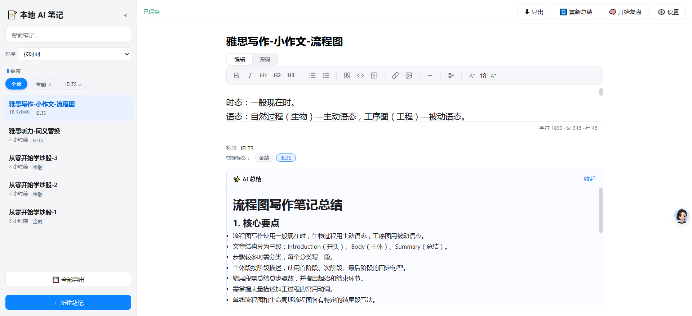
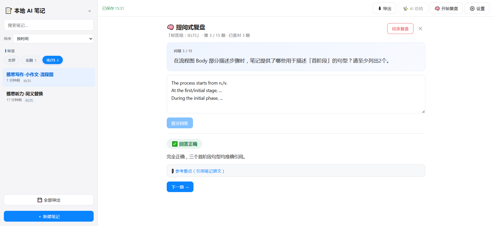
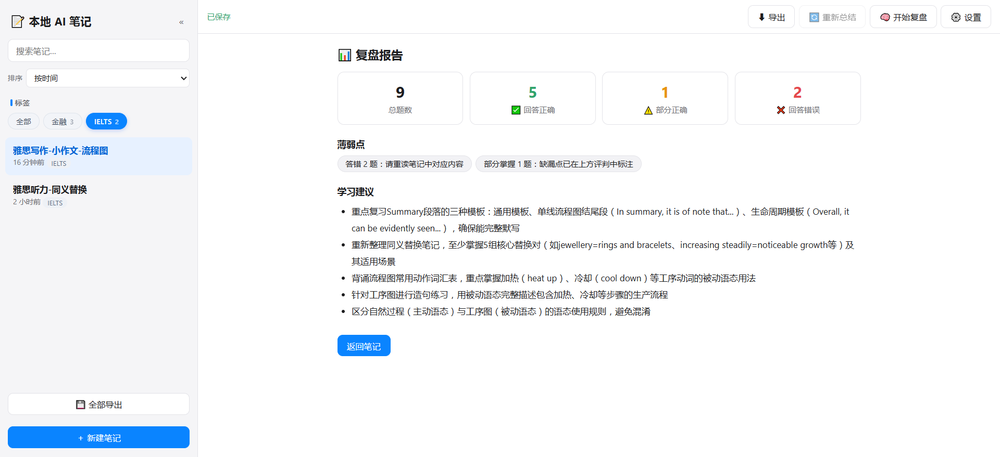

# 本地 AI 笔记（Local AI Notes）

> 一个零依赖、完全本地运行的 AI 笔记应用，支持 AI 总结与提问式复盘。

一个**完全本地运行**的 AI 笔记应用：Markdown 笔记管理 + AI 总结 + 多 AI 厂商接入 + **提问式复盘**（AI 出题 → 你回答 → AI 依据笔记原文评判对错）。

**零依赖**：后端只用 Node.js 内置模块，前端是原生 HTML/CSS/JS，**不需要 npm install**，数据全部保存在你自己的电脑上。

## 🚀 新手通道（不熟悉技术？从这里开始）

**下载 Windows 完整包 → 解压 → 双击 start.bat，浏览器自动打开，全程不需要安装任何东西。**

1. 打开 [Releases 页面](https://github.com/Mengxingyu-cn/local-ai-notes/releases/latest)
2. 下载最新的 **Windows 完整包**（文件名形如 `local-ai-notes-X.X.X-windows-portable.zip`，内置了 Node.js）
3. 解压到你喜欢的任意文件夹
4. 双击 `start.bat`，浏览器会自动打开应用（首次打开请先在右上角设置里配置 AI Key，纯笔记功能不需要）

> 提示：完整包内置了便携版 Node.js（v24.14.0），不需要安装 Node；想自己安装 Node 的也可以参考下方“快速开始”。

## ✨ 界面预览

<p align="center">
  
  
  
</p>

## 功能

| 功能 | 说明 |
|---|---|
| 📝 笔记管理 | 新建 / 编辑 / 删除（软删除进回收站）/ 搜索 / 标签筛选，1 秒自动保存，支持撤销重做（Ctrl+Z / Ctrl+Y） |
| 🖥 实时渲染编辑 | 文档始终显示排版效果；光标所在的**标题/列表/引用/代码块/表格**显示 Markdown 源码（`# `、`- `、`> `、``` 围栏、`\| 表格 \|` 可见），光标离开立刻渲染；支持图片、表格、分割线、行内代码、加粗斜体；中文输入法、粘贴、Tab 流畅支持 |
| 🖱 Markdown 工具栏 | 加粗 / 斜体 / 标题 / 列表 / 引用 / 代码 / 链接 / 图片 / 分割线，一键插入，支持字号调节（A⁻/A⁺） |
| 📑 侧边栏目录 | 一键生成标题大纲（H1-H3），点击跳转 |
| 🏷 标签分类 | 标签筛选 + 快捷标签一键添加/移除 + 列表显示标签 |
| 🔀 笔记排序 | 按时间（默认）/ 名称 A-Z / 自定义（拖动排序） |
| 🗑 回收站 | 删除的笔记和复盘记录都先进回收站（含 AI 总结一并保留），可恢复或彻底删除；上限 200 条，满时提示清理后再删除 |
| 💾 导出 | 单篇导出 .md 文件；全部笔记一键导出为一个 .md 文件 |
| 📊 字数统计 | 编辑区右下角实时显示 字符 / 词 / 行 统计 |
| ✨ AI 总结 | 一键生成结构化总结，自动保存到笔记，重新打开可见；已总结笔记再次点击会询问是否重新生成 |
| 🔌 多 AI 接入 | 预设 DeepSeek / Kimi / OpenAI / 通义千问 / 智谱 / OpenRouter / Anthropic / Ollama + 自定义 OpenAI 兼容端点 |
| 🧠 标签组复盘 | 选择标签组后**多选要复盘的笔记**，AI 根据所选笔记自动决定题数并逐题提问 → 你回答 → AI 判定 对/部分对/不对并引用笔记原文；所选内容超预算时弹窗明确提示（建议分批或减少选择） |
| 📚 复盘历史 | 每次复盘报告自动保存：统计、薄弱点、学习建议 + **答题详情**（题目/你的回答/评判/原文引用，支持错题回看） |

## 快速开始

### 第一步：获取 Node.js（二选一）

**方式 A（新手推荐，零安装）：** 便携版 Node.js —— 下载后放入项目 `node/` 文件夹即可，不需要安装任何东西。

1. 打开 <https://nodejs.org/en/download>
2. 在 Windows 部分选择 **Windows Binary (.zip)** 下载
3. 解压后把文件夹里的内容（`node.exe` 等）全部复制到项目的 `node/` 文件夹
4. 完成（更详细说明见项目内 `node/README.txt`）

**方式 B：** 安装 Node.js —— [官网](https://nodejs.org/) 下载 LTS 版安装，终端运行 `node -v` 确认版本为 18 或更高（v22 已测试）。

### 第二步：获取代码

- **方式 A（推荐，方便升级）：** `git clone https://github.com/Mengxingyu-cn/local-ai-notes.git`
- **方式 B：** 在仓库页面点击 Code → Download ZIP，解压到任意目录

### 第三步：启动

**Windows**：双击 `start.bat`（脚本自动使用 `node/` 文件夹里的便携版 Node，找不到时退回系统安装版；自动检查版本、自动打开浏览器）。

**macOS / Linux**：在项目目录下打开终端：

```bash
node server.js
# 或者（已安装依赖管理器时）：
npm start
```

然后浏览器访问 http://localhost:3000。

自定义端口（按你的系统选择）：

- macOS / Linux：`PORT=8080 node server.js`
- Windows cmd：`set PORT=8080 && node server.js`
- Windows PowerShell：`$env:PORT=8080; node server.js`

> ⚠️ **安全提示**：服务只监听本机（127.0.0.1），这是有意设计——应用没有登录认证，**请勿修改代码将监听地址改为 0.0.0.0**，否则局域网任何人都能读写你的笔记并消耗你的 API 配额。

### 第四步：配置 AI Key

1. 点击右上角 **⚙️ 设置**，选择 AI 提供商，填入 API Key 和模型名，先点 **🔌 测试连接** 验证，再点 **保存**。
2. 各厂商 Key 获取地址：
   - DeepSeek：<https://platform.deepseek.com>
   - Kimi：<https://platform.moonshot.cn>
   - 通义千问（百炼）：<https://bailian.console.aliyun.com>
   - 智谱：<https://open.bigmodel.cn>（GLM 免费档模型）
   - Ollama 本地：先 `ollama pull qwen3:8b` 再启动 `ollama serve`，Key 随便填

> ⚠️ **模型名时效提示**：应用内置的预设模型名以发布时官方文档为准，厂商迭代快，可能已过期。报"模型不存在"时请到对应厂商官方文档查询最新模型名，在设置页直接修改即可（也可选"自定义（OpenAI 兼容）"填任意端点）。

## 常见问题（FAQ）

**打不开 http://localhost:3000？**
1. 确认启动窗口还在（关掉窗口 = 停止服务）；2. 确认端口没被占用（见下一条）；3. 用浏览器无痕窗口再试。

**端口被占用？**
换端口启动（见"快速开始"的 PORT 说明），或关掉占用 3000 端口的程序（Windows 可在启动窗口看到提示）。

**AI 报错各是什么意思？**
- 401：API Key 无效或未配置 → 去设置页重新填 Key
- 402：账户余额不足 → 去厂商控制台充值
- 403：无权限访问该模型 → 检查账号的模型权限
- 404：接口地址或模型不存在 → 检查 Base URL 与模型名
- 429：请求频率超限或配额不足 → 稍后再试或换模型
- 5xx / 503：AI 服务端暂时不可用 → 稍后重试，或换一家提供商
- "请求超时"：网络慢或模型慢 → 换更快的模型或检查网络

**AI 总结后刷新就没了？**
总结会自动保存到笔记里（笔记对象含 `summary` 字段）。如果你修改过代码，请重启 `node server.js`（后端改动必须重启进程才生效）并硬刷新浏览器（Ctrl+Shift+R）。

## 数据、备份与升级

- **所有数据都在项目目录的 `data/` 文件夹里**（这也是唯一需要备份的东西）：
  - `notes.json`：笔记内容（含 AI 总结）
  - `settings.json`：AI 配置（含 API Key）
  - `reviews.json`：进行中的复盘会话
  - `review-history.json`：复盘历史记录
  - `trash.json`：回收站
- **备份/迁移**：直接复制 `data/` 目录即可。换电脑 = 装 Node + 拷贝项目（或新安装后把 `data/` 放回）。
- **升级**：`git pull` 不会碰你的数据（`data/` 已被 .gitignore 排除）；下载新版覆盖时，先备份 `data/`，覆盖除 `data/` 外的文件后把 `data/` 放回。
- **数据保护**：写入采用原子替换，存储文件损坏时自动备份为 `data/*.bak-时间戳` 并回退默认值（不会静默覆盖丢数据）。
- 另外应用内置 **导出功能**：顶栏"⬇ 导出"导出当前笔记 .md，侧边栏"💾 全部导出"把全部笔记导出为一个 .md 文件。

## 数据与隐私

- **API Key 明文保存在本地** `data/settings.json`——只在你自己的电脑上使用，不要在共享账户/公共电脑上使用，不要把这个文件发给任何人。
- 笔记内容**只在调用 AI 总结/复盘时**发送给你配置的 AI 厂商。
- 笔记中的远程 Markdown 图片会在渲染时**自动加载**，访问图片所在网站（会连接外部网站，图片链接来源需自行确认）。

## 项目结构

```
local-ai-notes/
├── server.js      # HTTP 服务入口：静态文件 + 全部 API 路由
├── storage.js     # JSON 文件存储（原子写入 + 损坏自动备份）
├── ai.js          # 统一 OpenAI 兼容调用 + 8 家厂商预设
├── review.js      # 提问式复盘引擎（出题/评判/报告）+ AI 总结 + 复盘历史
├── start.bat      # Windows 双击启动脚本
├── public/        # 前端（原生三件套）
│   ├── index.html
│   ├── app.css
│   └── app.js
└── data/          # 运行时生成：笔记与设置（已被 .gitignore 排除）
```

## API 一览

| 方法 | 路径 | 说明 |
|---|---|---|
| GET | /api/notes | 笔记列表（按更新时间排序） |
| POST | /api/notes | 新建笔记 `{title, content, tags}` |
| GET | /api/notes/:id | 单篇笔记详情 |
| PUT | /api/notes/:id | 更新笔记（title/content/tags，部分更新） |
| DELETE | /api/notes/:id | 软删除笔记（移入回收站） |
| POST | /api/notes/reorder | 自定义排序 `{ids: [...]}` |
| GET | /api/trash | 回收站列表 |
| POST | /api/trash/:id/restore | 恢复回收站笔记 |
| DELETE | /api/trash/:id | 彻底删除回收站笔记 |
| POST | /api/trash/clear | 清空回收站 |
| GET | /api/settings | 读 AI 配置（脱敏，不返回 Key） |
| PUT | /api/settings | 保存 AI 配置 |
| GET | /api/providers | 厂商预设列表 |
| POST | /api/ai/test | 连通性测试（不保存） |
| POST | /api/ai/summarize | `{noteId}` → `{summary}`（自动持久化） |
| POST | /api/ai/review/start | `{tag, noteIds}`（标签组内多选笔记）或 `{noteId}` → `{sessionId, question, noteTitle}` |
| POST | /api/ai/review/answer | `{sessionId, answer}` → `{verdict, nextQuestion, done, stats}` |
| POST | /api/ai/review/end | `{sessionId}` → `{report}`（自动存入复盘历史） |
| GET | /api/review-history | 复盘历史列表 |
| GET | /api/review-history/:id | 单条复盘记录详情 |
| DELETE | /api/review-history/:id | 软删除复盘记录（移入回收站，可恢复） |

## 修改指南

- **换 AI 厂商 / 改默认模型**：`ai.js` 顶部的 `PROVIDERS` 数组（注意与 `storage.js` 的 `DEFAULT_SETTINGS` 保持一致）；运行中可直接在设置页改（优先级更高）。
- **一轮复盘题数**：`review.js` 顶部 `MAX_QUESTIONS`（默认 8）。
- **复盘上下文上限**：单篇笔记 `review.js` 顶部 `MAX_NOTE_CHARS`（默认 12000 字符）；多篇聚合 `GROUP_MAX`（默认 40000 字符，且前端 `public/app.js` 顶部的 `REVIEW_BUDGET` 需与之一致）。
- **回收站上限**：`server.js` 顶部 `TRASH_LIMIT`（默认 200 条，满时拒绝新删除并提示）。
- **端口**：`PORT` 环境变量。
- **界面文案/样式**：`public/index.html`（结构）、`public/app.css`（样式）、`public/app.js`（逻辑）。
- **工具栏按钮与插入规则**：`public/app.js` 的 `MD_RULES` 对象。
- **Markdown 渲染规则**：`public/app.js` 的 `renderMarkdown` / `inlineMd` 函数。

## 许可证

[MIT](LICENSE) © 2026 Mengxingyu
